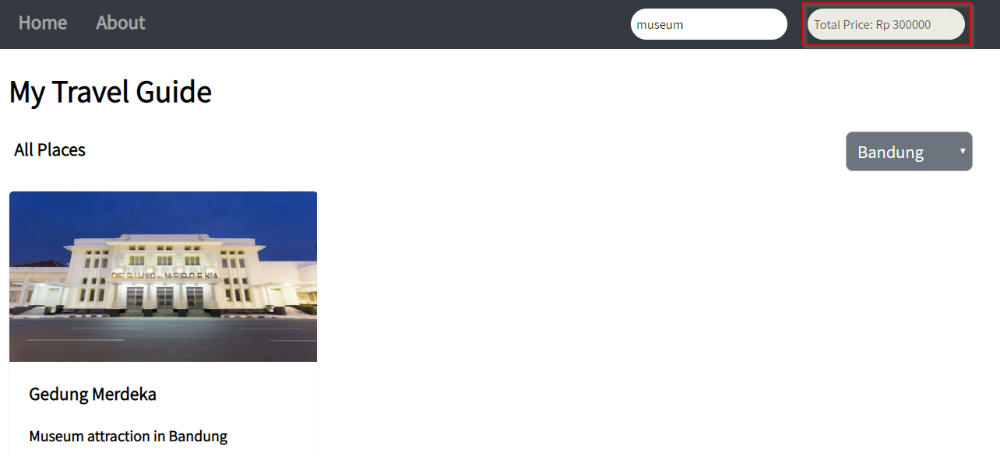

# Hacktiv8 Web App Development
# Travel Guide Website

Pada Project _Travel Guide Website_ ini, terdapat beberapa hal sebagai berikut:

1. _Landing Page_ yang dapat **menampilkan berbagai destinasi dan kota**
2. Terdapat **biaya untuk akomodasi ke destinasi tersebut**
3. Projek ini menitikberatkan penggunaan HTML untuk mengembangkan webpage, CSS untuk styling, serta JavaScript dan DOM untuk melihat destinasi dan kota termasuk biaya akomodasinya

Project ini dapat di akses di [sini](https://faridrah0514.github.io/).

Project ini dimulai dari 0 tanpa menggunakan framework apapun.

## App Functionality
Halaman utama pada aplikasi ini menampilkan daftar destinasi (seperti Museum, Nature, dll). Setiap destinasi harus memiliki:

    - Judul destinasi
    - Deskripsi
    - Gambar destinasi
    - Lokasi
    - Biaya

Homepage dari aplikasi Travel Guide ini menunjukkan judul dan semua daftar destinasi, hingga tombol drop down untuk memfilter dan menampilkan nama kota. Search input dapat digunakan mencari destinasi. Landing page yang dibuat terlihat seperti di bawah:

**1. Landing Page**

**2. Lightbox**

Setiap destinasi memiliki keterkaitan dengan Total Price yang dapat menghitung biaya dari setiap destinasi yang dipilih. Saat kamu memilih destinasi yang berbeda dengan menekan tombol “Add to Wishlist”, total biaya yang muncul akan bertambah sesuai dengan destinasi yang sudah dipilih

**3. Search box**

Halaman utama juga memiliki search form, yang dapat mencari destinasi dan menambahkannya ke Wishlist.

Search form tersebut memiliki text input yang dapat digunakan untuk langsung menemukan destinasi. Saat value yang ada pada text input berubah, destinasi yang cocok dengan inputan tersebut akan muncul.

selection box juga dapat memfilter berdasarkan kota

**4. Total Price**

Saat mengklik tombol add to wishlist, My Travel Guide akan mengkalkulasi total biaya. Kalkulasi ini termasuk dalam total price element yang terletak pada ‘navbar’

Demikian project My Travel Website ini saya buat.
Feel free to comment and give an input

**Farid Rahman | _fr.farid.rahman@gmail.com_**